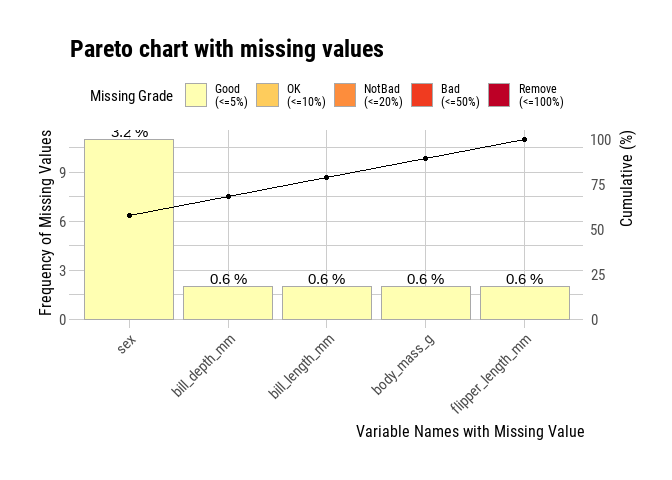
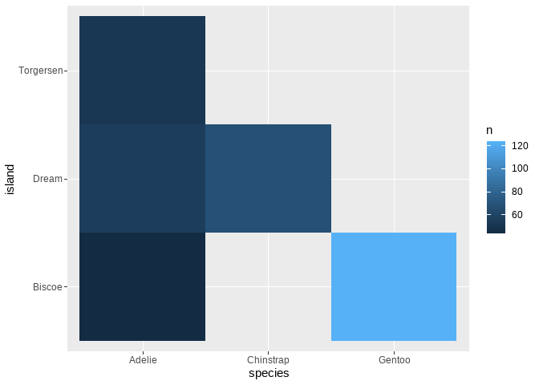
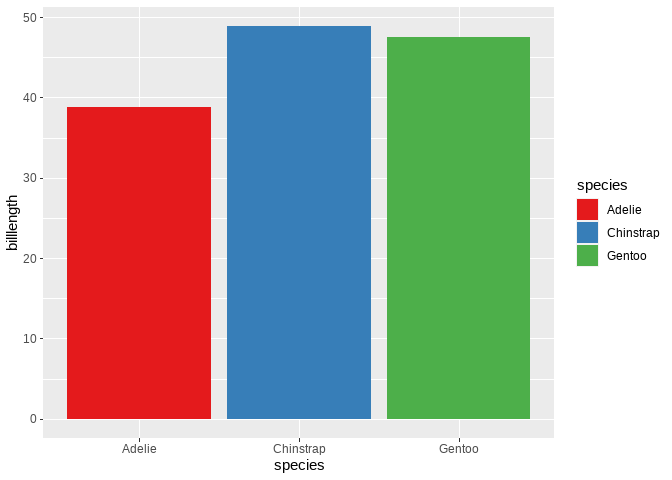
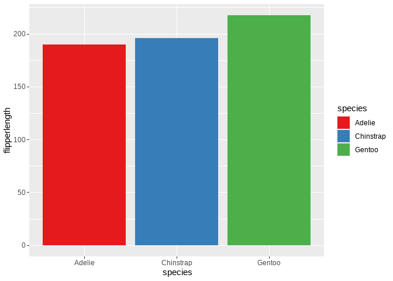
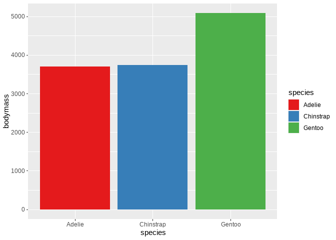
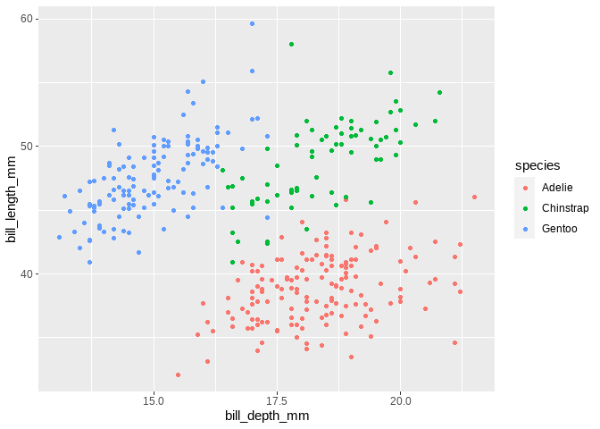
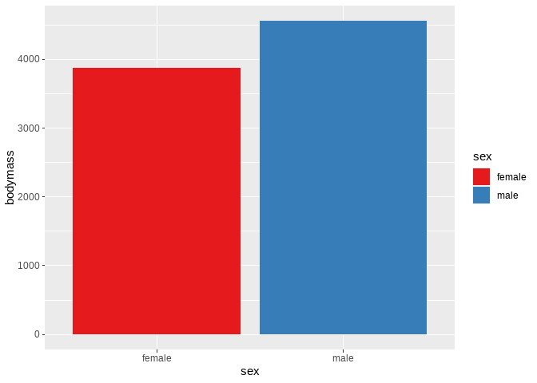
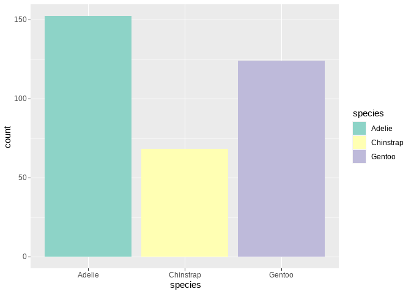

PalmerPenguins model and Shiny App
================
francis kyalo
2023-02-17

## Project Overview

The Palmer Penguins dataset is a collection of morphological and
ecological measurements for three species of penguins (Adelie,
Chinstrap, and Gentoo) observed on three islands in the Palmer
Archipelago, Antarctica. It was first introduced by ecologist
Dr. Kristen Gorman and her colleagues in 2020.

The dataset includes various features of penguins, such as bill length,
flipper length, body mass, and sex.

## Objective

Predicting the *species* of a penguin based on its *morphological
features*.

## Data understanding

The dataset includes various features of penguins, such as bill length,
bill depth flipper length, body mass, year, species, island and sex.

This dataset has *344 instances and 8 columns*

The following is the meaning of each variable in the dataset:

Species: a factor denoting penguin species (Adélie, Chinstrap and
Gentoo)

Island: a factor denoting island in Palmer Archipelago, Antarctica
(Biscoe, Dream or Torgersen)

Bill_length_mm: a number denoting bill length (millimeters)

Bill_depth_mm: a number denoting bill depth (millimeters)

Flipper_length_mm: an integer denoting flipper length (millimeters)

Body_mass_g: an integer denoting body mass (grams)

Sex: a factor denoting penguin sex (female, male)

Year: an integer denoting the study year (2007, 2008, or 2009)

### Importing the required packages

``` r
library(tidyverse)
```

    ## Warning: package 'tidyverse' was built under R version 4.1.3

    ## -- Attaching packages --------------------------------------- tidyverse 1.3.1 --

    ## v ggplot2 3.4.0     v purrr   0.3.4
    ## v tibble  3.1.5     v dplyr   1.0.7
    ## v tidyr   1.1.4     v stringr 1.4.0
    ## v readr   2.1.2     v forcats 0.5.1

    ## Warning: package 'ggplot2' was built under R version 4.1.3

    ## Warning: package 'readr' was built under R version 4.1.3

    ## -- Conflicts ------------------------------------------ tidyverse_conflicts() --
    ## x dplyr::filter() masks stats::filter()
    ## x dplyr::lag()    masks stats::lag()

``` r
library(flextable)
```

    ## Warning: package 'flextable' was built under R version 4.1.3

    ## 
    ## Attaching package: 'flextable'

    ## The following object is masked from 'package:purrr':
    ## 
    ##     compose

``` r
library(dlookr)
```

    ## Warning: package 'dlookr' was built under R version 4.1.3

    ## 
    ## Attaching package: 'dlookr'

    ## The following object is masked from 'package:tidyr':
    ## 
    ##     extract

    ## The following object is masked from 'package:base':
    ## 
    ##     transform

``` r
library(caret)
```

    ## Loading required package: lattice

    ## 
    ## Attaching package: 'caret'

    ## The following object is masked from 'package:purrr':
    ## 
    ##     lift

``` r
library(palmerpenguins)
```

    ## Warning: package 'palmerpenguins' was built under R version 4.1.3

``` r
library(missRanger)
```

    ## Warning: package 'missRanger' was built under R version 4.1.3

``` r
library(smotefamily)
```

    ## Warning: package 'smotefamily' was built under R version 4.1.3

``` r
library(ROSE)
```

    ## Loaded ROSE 0.0-4

``` r
library(randomForest)
```

    ## randomForest 4.6-14

    ## Type rfNews() to see new features/changes/bug fixes.

    ## 
    ## Attaching package: 'randomForest'

    ## The following object is masked from 'package:dplyr':
    ## 
    ##     combine

    ## The following object is masked from 'package:ggplot2':
    ## 
    ##     margin

``` r
library(xgboost)
```

    ## 
    ## Attaching package: 'xgboost'

    ## The following object is masked from 'package:dplyr':
    ## 
    ##     slice

### Reading in the dataset

``` r
df <- palmerpenguins::penguins

df %>% head()
```

    ## # A tibble: 6 x 8
    ##   species island bill_length_mm bill_depth_mm flipper_length_~ body_mass_g sex  
    ##   <fct>   <fct>           <dbl>         <dbl>            <int>       <int> <fct>
    ## 1 Adelie  Torge~           39.1          18.7              181        3750 male 
    ## 2 Adelie  Torge~           39.5          17.4              186        3800 fema~
    ## 3 Adelie  Torge~           40.3          18                195        3250 fema~
    ## 4 Adelie  Torge~           NA            NA                 NA          NA <NA> 
    ## 5 Adelie  Torge~           36.7          19.3              193        3450 fema~
    ## 6 Adelie  Torge~           39.3          20.6              190        3650 male 
    ## # ... with 1 more variable: year <int>

## Data cleaning and wrangling

Data wrangling and cleaning is an important step in data science because
it is the process of transforming raw, untidy data into a structured and
usable format for analysis. The raw data that is collected from various
sources is often messy and contains errors, inconsistencies, and missing
values, which can compromise the accuracy of results and lead to
incorrect insights. Data wrangling and cleaning helps to identify and
correct these issues, ensuring that the data is high-quality and
reliable. This in turn helps to ensure that the data is ready for
analysis, visualization, and modeling, leading to more accurate and
trustworthy results. In this section, emphasis will be given to :

- Checking if dataset has appropriate(expected) data types for each of
  the columns

- Checking and Dealing with missing values

- Checking for and Dealing with duplicated values

- Checking dealing with outliers

### Checking data types

``` r
df %>% diagnose() %>% select(variables, types)
```

    ## # A tibble: 8 x 2
    ##   variables         types  
    ##   <chr>             <chr>  
    ## 1 species           factor 
    ## 2 island            factor 
    ## 3 bill_length_mm    numeric
    ## 4 bill_depth_mm     numeric
    ## 5 flipper_length_mm integer
    ## 6 body_mass_g       integer
    ## 7 sex               factor 
    ## 8 year              integer

Looks like the variables have the expected variable types as we would
have expected

### Checking and Dealing with missing values

``` r
df %>% diagnose() %>% select(variables, missing_count, missing_percent)
```

    ## # A tibble: 8 x 3
    ##   variables         missing_count missing_percent
    ##   <chr>                     <int>           <dbl>
    ## 1 species                       0           0    
    ## 2 island                        0           0    
    ## 3 bill_length_mm                2           0.581
    ## 4 bill_depth_mm                 2           0.581
    ## 5 flipper_length_mm             2           0.581
    ## 6 body_mass_g                   2           0.581
    ## 7 sex                          11           3.20 
    ## 8 year                          0           0

Visualizing the percentage of missing values of each of the variables to
check if they are problematic and warrant dropping of a particular
column

``` r
df %>% plot_na_pareto(only_na = TRUE)
```

<!-- -->

Notably, the variables
`bill_depth, bill_length, body_mass, sex and flipper_length` have
missing values. However, according to the pareto chart, the percentage
of missing values is not dire to warrant the removal of an entire column

Instead of dropping the missing values, an imputation of missing values
by chained random forest will be used by using predictive mean matching.

``` r
df <- df %>% as_tibble() %>%
  mutate(flipper_length_mm = 
           as.integer(flipper_length_mm),
          body_mass_g = as.integer(body_mass_g)) 

df_imputed <- missRanger(df, pmm.k=3, seed = 123)
```

    ## 
    ## Missing value imputation by random forests
    ## 
    ##   Variables to impute:       bill_length_mm, bill_depth_mm, flipper_length_mm, body_mass_g, sex
    ##   Variables used to impute:  species, island, bill_length_mm, bill_depth_mm, flipper_length_mm, body_mass_g, sex, year
    ## iter 1:  .....
    ## iter 2:  .....
    ## iter 3:  .....
    ## iter 4:  .....
    ## iter 5:  .....

Checking on the imputed dataset

``` r
df_imputed %>%  head()
```

    ## # A tibble: 6 x 8
    ##   species island bill_length_mm bill_depth_mm flipper_length_~ body_mass_g sex  
    ##   <fct>   <fct>           <dbl>         <dbl>            <int>       <int> <fct>
    ## 1 Adelie  Torge~           39.1          18.7              181        3750 male 
    ## 2 Adelie  Torge~           39.5          17.4              186        3800 fema~
    ## 3 Adelie  Torge~           40.3          18                195        3250 fema~
    ## 4 Adelie  Torge~           38.8          17.9              183        3650 fema~
    ## 5 Adelie  Torge~           36.7          19.3              193        3450 fema~
    ## 6 Adelie  Torge~           39.3          20.6              190        3650 male 
    ## # ... with 1 more variable: year <int>

##### Comparing the original dataset with the imputed dataset to check the effectiveness of the imputation by chained random forest on numeric variables

``` r
df %>% describe()
```

    ## # A tibble: 5 x 26
    ##   described_variabl~     n    na   mean      sd se_mean    IQR skewness kurtosis
    ##   <chr>              <int> <int>  <dbl>   <dbl>   <dbl>  <dbl>    <dbl>    <dbl>
    ## 1 bill_length_mm       342     2   43.9   5.46   0.295  9.27e0   0.0531   -0.876
    ## 2 bill_depth_mm        342     2   17.2   1.97   0.107  3.1 e0  -0.143    -0.907
    ## 3 flipper_length_mm    342     2  201.   14.1    0.760  2.3 e1   0.346    -0.984
    ## 4 body_mass_g          342     2 4202.  802.    43.4    1.2 e3   0.470    -0.719
    ## 5 year                 344     0 2008.    0.818  0.0441 2   e0  -0.0537   -1.50 
    ## # ... with 17 more variables: p00 <dbl>, p01 <dbl>, p05 <dbl>, p10 <dbl>,
    ## #   p20 <dbl>, p25 <dbl>, p30 <dbl>, p40 <dbl>, p50 <dbl>, p60 <dbl>,
    ## #   p70 <dbl>, p75 <dbl>, p80 <dbl>, p90 <dbl>, p95 <dbl>, p99 <dbl>,
    ## #   p100 <dbl>

``` r
df_imputed %>% describe()
```

    ## # A tibble: 5 x 26
    ##   described_variabl~     n    na   mean      sd se_mean    IQR skewness kurtosis
    ##   <chr>              <int> <int>  <dbl>   <dbl>   <dbl>  <dbl>    <dbl>    <dbl>
    ## 1 bill_length_mm       344     0   43.9   5.46   0.294     9.3   0.0529   -0.884
    ## 2 bill_depth_mm        344     0   17.1   1.97   0.106     3.1  -0.141    -0.903
    ## 3 flipper_length_mm    344     0  201.   14.1    0.760    23.2   0.343    -0.997
    ## 4 body_mass_g          344     0 4204.  803.    43.3    1206.    0.469    -0.731
    ## 5 year                 344     0 2008.    0.818  0.0441    2    -0.0537   -1.50 
    ## # ... with 17 more variables: p00 <dbl>, p01 <dbl>, p05 <dbl>, p10 <dbl>,
    ## #   p20 <dbl>, p25 <dbl>, p30 <dbl>, p40 <dbl>, p50 <dbl>, p60 <dbl>,
    ## #   p70 <dbl>, p75 <dbl>, p80 <dbl>, p90 <dbl>, p95 <dbl>, p99 <dbl>,
    ## #   p100 <dbl>

Clearly, the two datasets are almost similar as most of the measures of
central tendency such as mean, standard deviation and standard error

##### Comparing the original dataset with the imputed dataset to check the effectiveness of the imputation by chained random forest on categorical variables

``` r
df %>% count(sex)
```

    ## # A tibble: 3 x 2
    ##   sex        n
    ##   <fct>  <int>
    ## 1 female   165
    ## 2 male     168
    ## 3 <NA>      11

``` r
df_imputed %>% count(sex)
```

    ## # A tibble: 2 x 2
    ##   sex        n
    ##   <fct>  <int>
    ## 1 female   174
    ## 2 male     170

Similarly, for the categorical variable `sex` the imputation method does
a great job of ensuring that the balance within the group is maintained.

### Checking and dealing with duplicated values

``` r
df_imputed %>% duplicated() %>% sum()
```

    ## [1] 0

Looks like there are no duplicate values in the dataset

### Checking and dealing with outliers

``` r
df_imputed %>% diagnose_outlier() %>% select(variables, outliers_cnt, outliers_ratio)
```

    ## # A tibble: 5 x 3
    ##   variables         outliers_cnt outliers_ratio
    ##   <chr>                    <int>          <dbl>
    ## 1 bill_length_mm               0              0
    ## 2 bill_depth_mm                0              0
    ## 3 flipper_length_mm            0              0
    ## 4 body_mass_g                  0              0
    ## 5 year                         0              0

Suprisingly, the dataset also seems to be okay in regard to outliers

## Exploratory Data Analysis

##### 1. Species vs Island

``` r
df_imputed %>% count(species, island) %>% 
 ggplot(., aes(species, island, fill=n))+
 geom_tile()
```

<!-- -->

The most evident pattern from the heatmap is that the Gentoo species is
mostly found in Biscoe island and Chinstrap species in mostly found on
Dream island. Adelle species are found in all of the islands

##### 1. Species vs bill_length

``` r
df_imputed %>% group_by(species) %>% 
  summarise(billlength = mean(bill_length_mm)) %>% 
  ggplot(., aes(species, billlength, fill=species)) +
  geom_bar(stat = "identity") + 
  scale_fill_brewer(palette = 'Set1')
```

<!-- -->

From the bar graph, it is evident that the Chinstrap species has the
biggest bill_length compared to the other species. On the other, the
Adelle species has the smallest meanlegth of all the species.

##### 2. Species vs flipper_length

``` r
df_imputed %>% group_by(species) %>% 
  summarise(flipperlength = mean(flipper_length_mm)) %>% 
  ggplot(., aes(species, flipperlength, fill=species)) +
  geom_bar(stat = "identity") + 
  scale_fill_brewer(palette = 'Set1')
```

<!-- -->

From the barplot, it is evident that the Gentoo species has a bigger
flipper length compared to the other species. Additionally, it also
looks like the Adelle species has a smallest flipper length of all the
species.

##### 3. Species vs body_masss

``` r
df_imputed %>% group_by(species) %>% 
  summarise(bodymass = mean(body_mass_g)) %>% 
  ggplot(., aes(species, bodymass, fill=species)) +
  geom_bar(stat = "identity") + 
  scale_fill_brewer(palette = 'Set1')
```

<!-- -->

It is very clear from the barplot above that the Gentoo species has a
significant bodymass compared to other other two species which almost
have identical bodymass averages

##### 4. Bill_length vs bill_depth

``` r
ggplot(df_imputed, aes(bill_depth_mm, bill_length_mm, colour=species)) + 
  geom_point() +
   scale_fill_brewer(palette = 'Set1')
```

<!-- -->

From the scatterplot, it is very evident that the Gentoo species has a
relatively longer bill_lengths and shorter bill_depth. Chinstraps seem
to have longer bill_lengths and also longer bill_depth. On the other
hand , Adelle seem to have larger bill_depth and and shorter bill_length

##### 5. Sex vs body_mass

``` r
df_imputed %>% group_by(sex) %>% 
  summarise(bodymass = mean(body_mass_g)) %>% 
  ggplot(., aes(sex, bodymass, fill=sex)) +
  geom_bar(stat = "identity") + 
  scale_fill_brewer(palette = 'Set1') 
```

<!-- -->

On average, male penguins seem to have more body_mass compared to female
penguins

##### 6. Species count

``` r
ggplot(df_imputed, aes(species, fill=species))+
  geom_bar() + 
  scale_fill_brewer(palette = 'Set3')
```

<!-- -->

The barplot above shows that there is some bit of class imbalance as
some of the species have more instances that others

## Data Preparation

First thing first, the `year` column will be dropped as it will not
provide the model with a lot of information to make predictions in the
future

``` r
df_imputed <- df_imputed %>% select(-year)
```

#### Checking for highly correlated features

``` r
df_imputed %>% correlate() %>% flextable()
```

    ## PhantomJS not found. You can install it with webshot::install_phantomjs(). If it is installed, please make sure the phantomjs executable can be found via the PATH variable.

Only body_mass and flipper_length_mm have a high correlation. However,
they both will be used in the modelling as their correlation does not
exceed 0.9 which may be thought as very highly correlated

#### Dealing with dummy variables

``` r
penguins_dummy <- dummyVars(species ~ ., data = df_imputed)
penguins_dummy_tibble <- as_tibble(predict(penguins_dummy, newdata = df_imputed))
```

    ## Warning in model.frame.default(Terms, newdata, na.action = na.action, xlev =
    ## object$lvls): variable 'species' is not a factor

``` r
data <- cbind(species = df_imputed$species, penguins_dummy_tibble)

head(data)
```

    ##   species island.Biscoe island.Dream island.Torgersen bill_length_mm
    ## 1  Adelie             0            0                1           39.1
    ## 2  Adelie             0            0                1           39.5
    ## 3  Adelie             0            0                1           40.3
    ## 4  Adelie             0            0                1           38.8
    ## 5  Adelie             0            0                1           36.7
    ## 6  Adelie             0            0                1           39.3
    ##   bill_depth_mm flipper_length_mm body_mass_g sex.female sex.male
    ## 1          18.7               181        3750          0        1
    ## 2          17.4               186        3800          1        0
    ## 3          18.0               195        3250          1        0
    ## 4          17.9               183        3650          1        0
    ## 5          19.3               193        3450          1        0
    ## 6          20.6               190        3650          0        1

#### Splitting data to training and testing set

``` r
split <- createDataPartition(data$species, p = .8, 
                                  list = FALSE)

trainset <- data[split,]

testset <- data[-split,] 
```

#### Preprocessing the data by centering and scaling

``` r
numeric_vars_train <- trainset %>% select(bill_length_mm,
                                    bill_depth_mm, 
                                    flipper_length_mm,
                                    body_mass_g)

numeric_vars_test <- testset %>% select(bill_length_mm,
                                    bill_depth_mm, 
                                    flipper_length_mm,
                                    body_mass_g)

categorical_vars_train <- trainset %>% select(species, island.Biscoe,
                                              island.Dream, island.Torgersen,
                                              sex.male, sex.female)

categorical_vars_test <- testset %>% select(species, island.Biscoe,
                                              island.Dream, island.Torgersen,
                                              sex.male, sex.female)


preProcValues <- preProcess(numeric_vars_train, method = c("center", "scale"))

num_vars_train_trans <- predict(preProcValues,numeric_vars_train )
num_vars_test_trans <- predict(preProcValues, numeric_vars_test)

training_set <- cbind(categorical_vars_train, num_vars_train_trans)

testing_set <- cbind(categorical_vars_test, num_vars_test_trans)
```

# training the a random forest model

``` r
ctrl <- trainControl(
  method = "repeatedcv", 
  repeats = 3)


rf_model <- train(
  species ~ .,
  data = training_set,
  method = "rf",
  trControl = ctrl,
  tuneLength= 5)
```

``` r
rf_model
```

    ## Random Forest 
    ## 
    ## 277 samples
    ##   9 predictor
    ##   3 classes: 'Adelie', 'Chinstrap', 'Gentoo' 
    ## 
    ## No pre-processing
    ## Resampling: Cross-Validated (10 fold, repeated 3 times) 
    ## Summary of sample sizes: 250, 249, 249, 250, 249, 249, ... 
    ## Resampling results across tuning parameters:
    ## 
    ##   mtry  Accuracy   Kappa    
    ##   2     0.9893237  0.9833206
    ##   3     0.9893237  0.9833206
    ##   5     0.9893237  0.9833206
    ##   7     0.9868987  0.9794963
    ##   9     0.9831950  0.9737663
    ## 
    ## Accuracy was used to select the optimal model using the largest value.
    ## The final value used for the model was mtry = 2.

### predicting using the model

``` r
y_pred_rf = predict(rf_model, newdata = testing_set)

confusionMatrix(testing_set$species, y_pred_rf)
```

    ## Confusion Matrix and Statistics
    ## 
    ##            Reference
    ## Prediction  Adelie Chinstrap Gentoo
    ##   Adelie        29         1      0
    ##   Chinstrap      0        13      0
    ##   Gentoo         0         0     24
    ## 
    ## Overall Statistics
    ##                                           
    ##                Accuracy : 0.9851          
    ##                  95% CI : (0.9196, 0.9996)
    ##     No Information Rate : 0.4328          
    ##     P-Value [Acc > NIR] : < 2.2e-16       
    ##                                           
    ##                   Kappa : 0.9766          
    ##                                           
    ##  Mcnemar's Test P-Value : NA              
    ## 
    ## Statistics by Class:
    ## 
    ##                      Class: Adelie Class: Chinstrap Class: Gentoo
    ## Sensitivity                 1.0000           0.9286        1.0000
    ## Specificity                 0.9737           1.0000        1.0000
    ## Pos Pred Value              0.9667           1.0000        1.0000
    ## Neg Pred Value              1.0000           0.9815        1.0000
    ## Prevalence                  0.4328           0.2090        0.3582
    ## Detection Rate              0.4328           0.1940        0.3582
    ## Detection Prevalence        0.4478           0.1940        0.3582
    ## Balanced Accuracy           0.9868           0.9643        1.0000

### fitting a xgboost model

``` r
xg_model <- train(species ~ .,
                  data = training_set, 
                   method = "xgbTree",
                   tuneLength = 10, 
                    trControl = trainControl(search = "random"))
```

``` r
xg_model
```

    ## eXtreme Gradient Boosting 
    ## 
    ## 277 samples
    ##   9 predictor
    ##   3 classes: 'Adelie', 'Chinstrap', 'Gentoo' 
    ## 
    ## No pre-processing
    ## Resampling: Bootstrapped (25 reps) 
    ## Summary of sample sizes: 277, 277, 277, 277, 277, 277, ... 
    ## Resampling results across tuning parameters:
    ## 
    ##   eta        max_depth  gamma     colsample_bytree  min_child_weight  subsample
    ##   0.1009376   8         1.851105  0.3857794         10                0.6461119
    ##   0.1194295   9         4.639340  0.3633143          4                0.9346883
    ##   0.2477199   9         7.160676  0.3134808         18                0.3577000
    ##   0.3717430   1         6.036911  0.6857764          9                0.3499428
    ##   0.3722103  10         9.768127  0.5626848          8                0.6941678
    ##   0.4123204   8         5.308577  0.5935536          1                0.9585262
    ##   0.4200398   1         7.037100  0.6684547         10                0.6185621
    ##   0.4243877   5         7.248288  0.4322193          4                0.9939525
    ##   0.4510423   6         2.205638  0.4444956          4                0.8408497
    ##   0.5543413   1         6.919934  0.4260543          0                0.8524009
    ##   nrounds  Accuracy   Kappa    
    ##     7      0.9530063  0.9247819
    ##   363      0.9732934  0.9575310
    ##   290      0.8981765  0.8339077
    ##   110      0.9614136  0.9385697
    ##   112      0.9644972  0.9433465
    ##   730      0.9744456  0.9594450
    ##   573      0.9652909  0.9449227
    ##   779      0.9688840  0.9505983
    ##   349      0.9774701  0.9644374
    ##   897      0.9649020  0.9444155
    ## 
    ## Accuracy was used to select the optimal model using the largest value.
    ## The final values used for the model were nrounds = 349, max_depth = 6, eta
    ##  = 0.4510423, gamma = 2.205638, colsample_bytree = 0.4444956,
    ##  min_child_weight = 4 and subsample = 0.8408497.

``` r
y_pred_xg = predict(xg_model, newdata = testing_set)

confusionMatrix(testing_set$species, y_pred_xg)
```

    ## Confusion Matrix and Statistics
    ## 
    ##            Reference
    ## Prediction  Adelie Chinstrap Gentoo
    ##   Adelie        29         0      1
    ##   Chinstrap      0        12      1
    ##   Gentoo         0         0     24
    ## 
    ## Overall Statistics
    ##                                           
    ##                Accuracy : 0.9701          
    ##                  95% CI : (0.8963, 0.9964)
    ##     No Information Rate : 0.4328          
    ##     P-Value [Acc > NIR] : < 2.2e-16       
    ##                                           
    ##                   Kappa : 0.9528          
    ##                                           
    ##  Mcnemar's Test P-Value : NA              
    ## 
    ## Statistics by Class:
    ## 
    ##                      Class: Adelie Class: Chinstrap Class: Gentoo
    ## Sensitivity                 1.0000           1.0000        0.9231
    ## Specificity                 0.9737           0.9818        1.0000
    ## Pos Pred Value              0.9667           0.9231        1.0000
    ## Neg Pred Value              1.0000           1.0000        0.9535
    ## Prevalence                  0.4328           0.1791        0.3881
    ## Detection Rate              0.4328           0.1791        0.3582
    ## Detection Prevalence        0.4478           0.1940        0.3582
    ## Balanced Accuracy           0.9868           0.9909        0.9615

### Final model

From the performance of the two fitted models, it looks like the *random
forest* `rf_model` model has better accuracy the the boosted model
